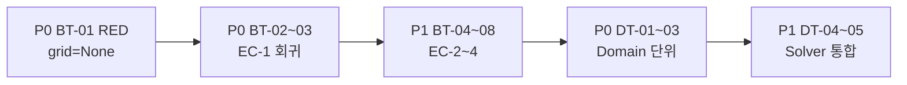
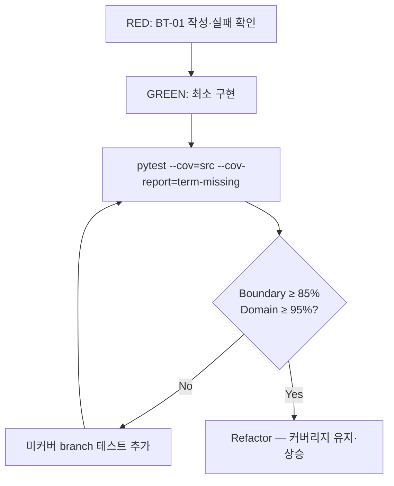

# Magic Square 4×4 — 테스트 계획서

| 항목 | 값 |
|------|-----|
| **작성 관점** | 시니어 QA Lead |
| **대상 스택** | Python 3.13+, pytest, pydantic |
| **기준 User Story** | US-01 — 입력 검증 (Boundary) |
| **시드 AC** | **AC-US-01-01** |
| **참조 문서** | `report/09-user-stories-magic-square-4x4-report.md`, `report/05-dual-track-clean-architecture-tdd-design.md` |
| **TDD 원칙** | Red → Green → Refactor (Dual-Track: Boundary / Domain) |

---

## 1. 목적 및 범위

본 계획서는 **AC-US-01-01** (`grid=None` → Boundary 거부, Domain 미호출)을 **P0 시드 RED 테스트**로 삼아, Magic Square 4×4 프로젝트의 pytest 기반 단위 테스트 전략을 정의한다.

### 1.1 In Scope

- Boundary(입력 검증·오류 매핑·응답 포맷) 단위 테스트
- Domain(Entity/Control) 단위 테스트 — Boundary Mock 없이 실제 Judge 사용
- Domain 진입점 `SolvePartialGrid.execute` 호출 횟수 검증 (mock/spy)
- pytest-cov 기반 branch 커버리지 측정 및 게이트

### 1.2 Out of Scope (본 계획 1차)

- E2E / 브라우저 UI 테스트
- Data 레이어(File/InMemory Repository) — 별도 Phase
- 성능·부하 테스트

---

## 2. 시드 예제 (AC-US-01-01)

| 항목 | 값 |
|------|-----|
| **AC ID** | AC-US-01-01 |
| **Layer** | Boundary |
| **Given** | `grid = None` |
| **When** | Boundary resolver(예: `solve_magic_square(grid)`) 호출 |
| **Then (기대 출력)** | `{ "code": "INVALID_SIZE", "message": "Grid must be 4x4." }` |
| **Then (격리)** | Domain 진입점 `SolvePartialGrid.execute` **호출 0회** |
| **보호 Contract** | IC-1, EC-1, IC-5 |

> **선택 근거:** 입력 형식 검증은 전체 파이프라인의 최선행 조건이며, `None` 입력은 Domain에 도달하기 전 즉시 실패해야 한다. 동일 테스트에서 mock/spy로 Domain 미호출을 함께 단언할 수 있다.

### 2.1 Pydantic Error Contract (고정 스키마)

```python
# src/boundary/schemas.py (예정)
class ErrorResponse(BaseModel):
    code: str
    message: str
    details: dict[str, int | str] | None = None
```

- `code`, `message`는 카탈로그와 **완전 일치** (스냅샷/상수 잠금)
- AC-US-01-01: `code="INVALID_SIZE"`, `message="Grid must be 4x4."`

---

## 3. pytest 단위 테스트 범위 및 우선순위

### 3.1 테스트 디렉터리 구조 (목표)

```
tests/
├── conftest.py                    # 공통 fixture, mock factory
├── boundary/
│   ├── test_input_validator.py    # IC-1~IC-4 검증 로직
│   ├── test_boundary_resolver.py    # AC-US-01-01 시드 + Domain 격리
│   └── test_error_contract.py       # pydantic 스키마·카탈로그 일치
├── domain/
│   ├── test_empty_cell_locator.py
│   ├── test_missing_number_resolver.py
│   ├── test_magic_square_judge.py
│   ├── test_placement_trial_solver.py
│   └── test_solve_partial_grid.py
└── integration/                   # Phase 2
    └── test_boundary_to_domain.py
```

### 3.2 우선순위 매트릭스

| 우선순위 | Track | 테스트 ID | 대상 | AC / Contract | RED 선행 여부 |
|----------|-------|-----------|------|---------------|---------------|
| **P0** | Boundary | `BT-01` | `grid=None` | AC-US-01-01, EC-1, IC-5 | **시드 — 최초 RED** |
| **P0** | Boundary | `BT-02` | 3×4, 4×5, 1차원 list | AC-US-01-01 변형, EC-1 | P0 |
| **P0** | Boundary | `BT-03` | 유효 입력 1건 | AC-US-01-05, IC-5 | Domain 호출 1회 확인 |
| **P1** | Boundary | `BT-04` | 셀 값 17, -1, `"7"` | AC-US-01-02, EC-2 | P0 이후 |
| **P1** | Boundary | `BT-05` | 빈칸 0/1/3개 | AC-US-01-03, EC-3 | P0 이후 |
| **P1** | Boundary | `BT-06` | non-zero 중복 | AC-US-01-04, EC-4 | P0 이후 |
| **P1** | Boundary | `BT-07` | 검사 순서 고정 | 설계 §2.3 순서 잠금 | P1 |
| **P2** | Boundary | `BT-08` | Error Contract 일관성 | AC-US-01-07 | P1 이후 |
| **P0** | Domain | `DT-01` | `EmptyCellLocator.locate` | US-02 AC 1~5 | Boundary Green 후 |
| **P0** | Domain | `DT-02` | `MissingNumberResolver.resolve` | US-03 AC 1~5 | Boundary Green 후 |
| **P0** | Domain | `DT-03` | `MagicSquareJudge.isMagic` | US-04 AC 1~8 | Boundary Green 후 |
| **P1** | Domain | `DT-04` | `PlacementTrialSolver.solve` | US-05 AC 1~5 | DT-03 이후 |
| **P1** | Domain | `DT-05` | `SolvePartialGrid.execute` E2E | US-05 AC 6~11 | DT-04 이후 |

### 3.3 Dual-Track 실행 순서



1. **Boundary Track 먼저:** IC 위반 시 Domain 미호출을 mock/spy로 잠금
2. **Domain Track:** Boundary Mock 없이 실제 `MagicSquareJudge` 사용 (RG-04)
3. **통합 Track (Phase 2):** Boundary + 실제 Domain 조합

---

## 4. 예외 / 특이 케이스 목록

### 4.1 Boundary — EC-1 (형식·크기, AC-US-01-01 계열)

| Case ID | 입력 | 기대 `code` | Domain 호출 | 비고 |
|---------|------|-------------|-------------|------|
| EC1-01 | `None` | `INVALID_SIZE` | 0 | **시드 AC-US-01-01** |
| EC1-02 | `[]` (빈 리스트) | `INVALID_SIZE` | 0 | 행 0 |
| EC1-03 | `[[1,2,3,4]]` (1×4) | `INVALID_SIZE` | 0 | 행 부족 |
| EC1-04 | 3×4 행렬 | `INVALID_SIZE` | 0 | UI-02 대응 |
| EC1-05 | 4×5 행렬 | `INVALID_SIZE` | 0 | 열 초과 |
| EC1-06 | 1차원 `[1..16]` | `INVALID_SIZE` | 0 | 2D 아님 |
| EC1-07 | 행 길이 불균일 `[[1,2,3,4],[1,2,3]]` | `INVALID_SIZE` | 0 | jagged array |
| EC1-08 | `float` 원소 포함 `[[1.0,...]]` | `INVALID_SIZE` | 0 | int 아님 → EC-1 |
| EC1-09 | 중첩 깊이 이상 `[[[1]]]` | `INVALID_SIZE` | 0 | 구조 오류 |

### 4.2 Boundary — EC-2 (값 범위)

| Case ID | 입력 | 기대 `code` | Domain 호출 |
|---------|------|-------------|-------------|
| EC2-01 | 셀 값 `17` | `CELL_VALUE_OUT_OF_RANGE` | 0 |
| EC2-02 | 셀 값 `-1` | `CELL_VALUE_OUT_OF_RANGE` | 0 |
| EC2-03 | 셀 값 `"7"` (str) | `CELL_VALUE_OUT_OF_RANGE` | 0 |
| EC2-04 | 셀 값 `None` | `CELL_VALUE_OUT_OF_RANGE` | 0 |

### 4.3 Boundary — EC-3 (빈칸 개수)

| Case ID | 입력 | 기대 `code` | Domain 호출 |
|---------|------|-------------|-------------|
| EC3-01 | 빈칸 0개 (완전 채움) | `EMPTY_CELL_COUNT_INVALID` | 0 |
| EC3-02 | 빈칸 1개 | `EMPTY_CELL_COUNT_INVALID` | 0 |
| EC3-03 | 빈칸 3개 | `EMPTY_CELL_COUNT_INVALID` | 0 |

### 4.4 Boundary — EC-4 (중복)

| Case ID | 입력 | 기대 `code` | Domain 호출 |
|---------|------|-------------|-------------|
| EC4-01 | non-zero `7` 두 번 | `DUPLICATE_NON_ZERO` | 0 |

### 4.5 Boundary — 검사 순서 특이 케이스 (BT-07)

| Case ID | 입력 | 기대 | 근거 |
|---------|------|------|------|
| ORD-01 | 3×4 + 셀값 17 | `INVALID_SIZE` (범위 아님) | 크기 검사가 범위보다 선행 |
| ORD-02 | 4×4, 빈칸 3 + 중복 | `EMPTY_CELL_COUNT_INVALID` | 설계 §2.3 순서 4번 |

### 4.6 Boundary — Domain 실패 매핑 (유효 입력)

| Case ID | Given | Mock Domain | 기대 `code` |
|---------|-------|-------------|-------------|
| DOM-01 | 유효 4×4 | `UnsolvableGrid` raise | `DOMAIN_UNSOLVABLE` |
| DOM-02 | 유효 4×4 | 성공 `[2,3,5,4,1,11]` | 성공 + `result` 일치 |

### 4.7 Domain — 전제 위반 (Boundary 통과 가정, Domain 단위)

| Case ID | 대상 API | 입력 | 기대 예외 |
|---------|----------|------|-----------|
| DM-E01 | `MagicSquareJudge.isMagic` | 0 포함 격자 | `GridNotComplete` |
| DM-E02 | `MagicSquareJudge.isMagic` | 3×4 | `InvalidGridSize` |
| DM-E03 | `PlacementTrialSolver.solve` | 두 배치 모두 실패 | `UnsolvableGrid` |

---

## 5. Domain 해결 진입점 호출 횟수 검증 전략 (mock/spy)

### 5.1 격리 대상

| 구분 | 심볼 | 역할 |
|------|------|------|
| **Domain 진입점** | `SolvePartialGrid.execute` | Control/Entity 호출 체인 단일 진입점 |
| **Boundary SUT** | `BoundaryResolver.solve` (가칭) | 입력 검증 → Domain 위임 |

> US-01 AC-US-01-05/06: IC-1~IC-4 위반 시 `execute` **0회**, 만족 시 **1회**.

### 5.2 pytest fixture 패턴 (`conftest.py`)

```python
from unittest.mock import MagicMock, create_autospec

import pytest

# from src.domain.solve_partial_grid import SolvePartialGrid  # 구현 후 활성화


@pytest.fixture
def domain_spy(mocker):
    """Domain 진입점 spy — 호출 횟수·인자 검증용."""
    spy = create_autospec(SolvePartialGrid, instance=True)
    spy.execute.return_value = [2, 3, 5, 4, 1, 11]
    mocker.patch(
        "src.boundary.resolver.SolvePartialGrid",
        return_value=spy,
    )
    return spy


@pytest.fixture
def boundary_resolver(domain_spy):
    """Boundary SUT + 주입된 Domain spy."""
    from src.boundary.resolver import BoundaryResolver

    return BoundaryResolver()
```

- **`pytest-mock`** (`mocker` fixture) 권장: `unittest.mock.patch`보다 테스트 격리가 명확
- **`create_autospec`**: 실제 시그니처 불일치 시 테스트 실패 → Contract 보호

### 5.3 AC-US-01-01 시드 테스트 (RED → GREEN)

```python
# tests/boundary/test_boundary_resolver.py

def test_ac_us_01_01_none_grid_rejects_without_domain_call(boundary_resolver, domain_spy):
    # Arrange
    grid = None

    # Act
    result = boundary_resolver.solve(grid)

    # Assert — Error Contract
    assert result.code == "INVALID_SIZE"
    assert result.message == "Grid must be 4x4."

    # Assert — Domain 격리 (IC-5)
    domain_spy.execute.assert_not_called()
```

### 5.4 호출 횟수 검증 규칙

| 시나리오 | `execute` 호출 횟수 | 검증 메서드 |
|----------|---------------------|-------------|
| EC-1~EC-4 위반 (BT-01~06) | **0** | `assert_not_called()` |
| 유효 입력 + Domain 성공 (BT-03) | **1** | `assert_called_once()` |
| 유효 입력 + Domain 실패 (DOM-01) | **1** | `assert_called_once_with(valid_grid)` |
| 재시도·캐시 없음 확인 | **≤ 1** | `call_count` property |

### 5.5 금지 / 주의

| 규칙 | 내용 |
|------|------|
| **RG-B01** | Boundary 테스트에서 Domain **내부** 서비스(`EmptyCellLocator` 등)를 개별 mock하지 않음 — 진입점 `execute`만 spy |
| **RG-B02** | Domain 단위 테스트(DT-*)에서는 Boundary mock **사용 금지** — 실제 Judge로 판정 |
| **RG-B03** | spy가 호출된 경우, `call_args`로 **원본 grid 객체**가 전달됐는지 추가 검증 (얕은 복사 vs 참조 명시) |

---

## 6. 커버리지 목표

| 레이어 | Branch 목표 | 측정 패키지 | 게이트 | 실측 (2026-05-29) |
|--------|---------------|-------------|--------|-------------------|
| **Domain** | **≥ 95%** | `src/domain/` | 로컬 `--fail-under=95` | **100%** |
| **Boundary** | **≥ 85%** | `src/boundary/` (GUI omit) | 로컬 `--fail-under=85` | **~98%** |
| **전체** | ≥ 90% (참고) | `src/` | 리포트만 (hard gate 아님) | line 59% (GUI 포함) |

### 6.1 Domain 측정 대상 (≥ 95%)

- `EmptyCellLocator`
- `MissingNumberResolver`
- `MagicSquareJudge`
- `PlacementTrialSolver`
- `SolvePartialGrid`

### 6.2 Boundary 측정 대상 (≥ 85%)

- `InputValidator` (IC-1~IC-4)
- `BoundaryResolver` (진입·위임)
- `ErrorMapper` / `ErrorResponse` (pydantic)
- `ResponseFormatter` (성공 출력)

### 6.3 커버리지에서 제외 (`pyproject.toml` — Phase 5 적용)

| 경로 | 사유 |
|------|------|
| `src/boundary/ui/main_window.py` | GUI — pytest-qt 미적용 |
| `src/boundary/ui/samples.py` | GUI 샘플 데이터 |
| `src/boundary/ui/status_mixin.py` | GUI mixin — smoke 미적용 |
| `main.py` | PyQt6 bootstrap |
| `src/entity/*` | Magic Square와 무관 scaffold |
| `tests/`, `__pycache__/` | 테스트·캐시 (coverage 기본 제외) |

> **측정 대상:** `src/boundary/` 핵심 + `src/boundary/ui/grid_io.py` + `src/domain/` 전체

---

## 7. pytest-cov 측정 전략

### 7.1 설치

```bash
pip install pytest pytest-cov pytest-mock pydantic
```

### 7.2 기본 실행 (로컬 개발)

```bash
pytest --cov=src --cov-report=term-missing
```

- `--cov-report=term-missing`: 미커버 line 번호를 터미널에 출력 → RED/Green 후 누락 branch 즉시 확인

### 7.3 레이어별 분리 측정 (Phase 5 — 권장)

```powershell
# 전체 + branch (GUI omit은 pyproject.toml 기본)
python -m pytest tests/ --cov=src/boundary --cov=src/domain --cov-branch -q

# Domain gate (≥ 95%)
python -m coverage report --include='src/domain/*' --fail-under=95

# Boundary gate (≥ 85%, GUI omit)
python -m coverage report --include='src/boundary/*' --omit='src/boundary/ui/main_window.py,src/boundary/ui/samples.py,src/boundary/ui/status_mixin.py' --fail-under=85
```

### 7.4 로컬 커버리지 게이트 (권장)

PR/merge 전 로컬에서 실행:

1. `python -m pytest tests/ -q`
2. `python -m pytest tests/regression/test_golden_master_solver.py -q`
3. branch coverage 측정 + Domain ≥95% / Boundary ≥85% gate (`coverage report --fail-under`)

> GitHub Actions CI(`.github/workflows/ci.yml`)는 PAT `workflow` scope 이슈로 **미적용**. 필요 시 별도 Phase에서 추가.

### 7.5 HTML 리포트 (로컬 선택)

```bash
pytest \
  --cov=src/boundary \
  --cov=src/domain \
  --cov-report=term-missing \
  --cov-report=html:htmlcov \
  --cov-branch \
  -q
```

| 옵션 | 용도 |
|------|------|
| `--cov-branch` | branch coverage 활성화 (목표 95%/85%는 branch 기준) |
| `--cov-fail-under=N` | 최소 커버리지 미달 시 exit code 1 |
| `htmlcov/index.html` | PR 리뷰용 시각 리포트 |

### 7.6 `pyproject.toml` 설정 (Phase 5 적용)

```toml
[tool.pytest.ini_options]
testpaths = ["tests"]
markers = [
    "boundary: Boundary layer contract tests",
    "domain: Domain layer invariant tests",
    "p0: Priority 0 — must pass before merge",
    "p1: Priority 1 tests",
    "p2: Priority 2 tests",
    "integration: Boundary + Domain integration tests",
    "regression: Regression protection suite",
]

[tool.coverage.run]
branch = true
source = ["src"]
omit = [
    "src/boundary/ui/main_window.py",
    "src/boundary/ui/samples.py",
    "src/boundary/ui/status_mixin.py",
    "main.py",
    "src/entity/*",
]

[tool.coverage.report]
show_missing = true
skip_empty = true
precision = 2
```

### 7.7 커버리지 게이트 워크플로



---

## 8. 테스트 작성 규약

| 규약 | 내용 |
|------|------|
| **AAA** | Arrange / Act / Assert 주석 또는 빈 줄로 구분 |
| **명명** | `test_<ac_id>_<조건>_<기대결과>` (예: `test_ac_us_01_01_none_grid_rejects_without_domain_call`) |
| **고정 메시지** | `message` 문자열 변경 시 Error Contract 테스트 일괄 갱신 (RG-02) |
| **회귀** | 버그 수정마다 RED 회귀 테스트 1건 추가 |
| **결정론** | random, time, I/O 없음 — fixture로 격자 고정 |
| **타입** | public 함수·fixture 반환값 pydantic model 또는 명시적 type hint |

---

## 9. Traceability (시드 → 테스트)

| Concept | Invariant | AC | Test ID | Component |
|---------|-----------|-----|---------|-----------|
| 4×4 격자 | INV-1 / IC-1 | AC-US-01-01 | BT-01, BT-02 | `InputValidator` |
| Domain 미호출 | IC-5 | AC-US-01-05, 06 | BT-01~06, BT-03 | `BoundaryResolver` + spy |
| Error Contract | EC-1 | AC-US-01-01, 07 | BT-01, BT-08 | `ErrorResponse` (pydantic) |
| Domain 진입 | UC-5 | AC-US-01-05 | BT-03, DT-05 | `SolvePartialGrid.execute` |

---

## 11. Refactor Phase 5 — Verify (2026-05-29)

| 항목 | 내용 |
|------|------|
| **테스트** | `209 passed` — Golden Master 23 포함 |
| **Domain branch** | **100%** — `magic_square_judge` main/anti diagonal fixture 보강 |
| **Boundary branch** | **~98%** (GUI omit) — `resolver`/`verifier` L49 re-raise 잔존 |
| **설정** | `pyproject.toml` markers + coverage omit |
| **게이트** | 로컬 `coverage report --fail-under` (GitHub Actions CI 미적용) |
| **계획서** | [report/12-refactoring-plan.md](../report/12-refactoring-plan.md) §11 |

### 11.1 대각선 fixture (DT-03 / AC-US-04-07)

행·열 합 34 유지, 대각선만 깨지는 격자 (`tests/fixtures/grids.py`):

| Fixture | 용도 |
|---------|------|
| `GRID_ALL_ROWS_VALID_MAIN_DIAG_BROKEN` | main diagonal ≠ 34, column check 통과 후 L31 분기 |
| `GRID_ALL_ROWS_VALID_ANTI_DIAG_BROKEN` | anti diagonal ≠ 34, main diag 통과 후 L36 분기 |

---

## 10. 1차 Sprint 체크리스트

- [x] `pip install pytest pytest-cov pytest-mock pydantic` 실행
- [x] `tests/boundary/test_boundary_resolver.py` — **BT-01 RED** (`grid=None`, Domain 0회)
- [x] `src/boundary/` 최소 Green — `INVALID_SIZE` 반환
- [x] `pytest --cov=src --cov-report=term-missing` — term-missing 확인
- [x] BT-02 (3×4, 1D) 회귀 추가
- [x] BT-03 (유효 입력 → `execute` 1회) 추가
- [x] Boundary branch **≥ 85%** (GUI omit) — 로컬 gate Green
- [x] Domain Track Green (DT-01~05) + branch **≥ 95%**
- [x] Golden Master baseline 23 tests + Refactor Phase 0~5

---

**문서 버전:** 1.1  
**최종 갱신:** 2026-05-29 (Phase 5 — 로컬 coverage gate)
