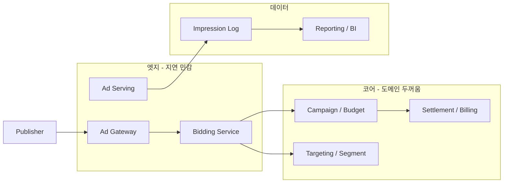

# Ad Server Architecture — Prompt Transcript
_Exported on 05/29/2026 from Cursor_

_주제: gRPC 강의 맥락 · 광고 MSA 아키텍처 · Java vs Go · Redis/PostgreSQL/Kafka/Batch/gRPC 학습 우선순위_

---

## 1) User

<user_query>
섹션 2. 개발 환경별 언어의 차이

1개 ∙ (7분)

5. 개발 환경에 대한 Java vs Go의 차이 알아보기

07:05

[... gRPC 강의 목차 섹션 2~7, 카카오·토스 개발자 대화, MSA·gRPC 소개 ...]

이런 강의 목록과 설명이야. 니 내용을 바탕으로 일단 섹션 2에 대해서 강의를 해줘
</user_query>

---

**Cursor**

# 섹션 2. 개발 환경별 언어의 차이
## 5강. 개발 환경에 대한 Java vs Go의 차이 알아보기

> **예상 분량:** 약 7분  
> **맥락:** 앞으로 gRPC·proto·MSA 실습을 할 때, “왜 회사마다 Java / Go를 나눠 쓰는가?”를 이해하는 단계입니다.

---

## 오프닝 (30초)

gRPC 강의를 시작하기 전에, 한 가지 질문을 던져 보겠습니다.

> “카카오·토스 같은 곳에서 MSA를 한다고 할 때, 서비스는 수백 개인데 **언어는 왜 Java와 Go가 자주 나올까요?**”

답의 절반은 **gRPC·proto**에 있고, 나머지 절반은 **각 언어가 만들어진 ‘개발 환경’의 철학**에 있습니다.  
이번 섹션에서는 gRPC 코드를 직접 짜기 전에, **Java 환경 vs Go 환경**이 무엇이 다른지 짚고 넘어갑니다.

---

## 1. 두 언어는 “문법”이 아니라 “환경”이 다르다 (1분)

| 비교 축 | Java | Go |
|--------|------|-----|
| 문법 | 클래스, 상속, 제네릭 | struct, interface, goroutine |
| 런타임 | JVM | 네이티브 바이너리 |
| 패키지 | Maven / Gradle | go mod |

**MSA·gRPC 관점:**

- **Java** → “큰 조직, 긴 수명의 서비스, 풍부한 생태계”에 최적화된 **플랫폼**
- **Go** → “작은 바이너리, 빠른 빌드, 단순한 동시성”에 최적화된 **언어 + 툴체인**

---

## 2. Java 개발 환경 — “무거우나 강하다” (2분)

- JVM 위에서 실행, GC·JIT, 성숙한 프로파일링 도구
- Spring, Kafka client, DB driver 등 **풍부한 생태계**
- **비즈니스 로직이 두꺼운 코어 서비스**에 적합 (eCommerce 실습 등)
- Gradle/Maven 빌드, JAR 배포, 컨테이너 이미지 상대적으로 무거움
- gRPC: `protoc` Java stub + Netty, Spring Boot 통합, 인터셉터·DI·ORM과 자연스럽게 연동
- **“기존 Java 모놀리스를 쪼개서 MSA로 가는 조직”**에 잘 맞음

---

## 3. Go 개발 환경 — “가볍고 빠르다” (2분)

- `go build` → 단일 바이너리 → 컨테이너 배포, **콜드 스타트 빠름**
- API Gateway, BFF, gRPC sidecar, **고빈도·저지연 RPC 중계**에 유리
- **goroutine + channel** — gRPC 스트리밍·양방향 통신(KakaoTalk 예제)에 자주 언급
- gRPC Go 구현이 1급 시민, proto → `pb.go` 생성 단순
- **“처음부터 MSA·클라우드 네이티브로 설계한 팀”**에 잘 맞음

---

## 4. MSA 100개를 상상할 때 — 왜 둘 다 쓰일까? (1분)

> “서비스가 많아질수록 **기하급수적으로 늘어나는 게 네트워크 통신 비용**이다.”

| 역할 | Java | Go |
|------|------|-----|
| 코어 비즈니스 | 도메인 복잡, 레거시 연동, 트랜잭션 | — |
| 고트래픽 엣지 | — | 작은 바이너리, 빠른 기동, 동시성 |
| gRPC 인프라 | Spring 생태계 | 공식 gRPC 구현, 단순 배포 |

**중요:** “MSA = 전부 Java” 또는 “전부 Go”가 정답이 아님. **일부 gRPC, 일부 JSON-RPC, 일부 WebSocket** — 상황에 따라 조합.

---

## 5. gRPC 학습 관점에서 꼭 기억할 차이 3가지

| # | Java | Go |
|---|------|-----|
| 1 | 생성 코드 장황, **엔터프라이즈 통합** 강함 | 생성 코드 짧고 **RPC·스트리밍** 직관적 |
| 2 | JVM 튜닝이 운영 스킬 | 바이너리·고루틴 튜닝이 운영 스킬 |
| 3 | “레거시 분리·두꺼운 도메인” | “클라우드 네이티브·고동시성” |

---

## 마무리 — 섹션 3 예고

- Java/Go로 **서비스를 많이 쪼갠다**
- 쪼갤수록 **호출 횟수·직렬화 비용** 폭발
- **HTTP/1.1 REST만으로는 한계** → **HTTP/2 기반 gRPC** 등장

---

## 2) User

<user_query>
일반적인 oltp말고 광고 도메인 서버 개발자가 청중으로 가정해서 알려줘
</user_query>

---

**Cursor**

# 섹션 2. 개발 환경별 언어의 차이 (광고 도메인 서버 개발자용)
## 5강. 개발 환경에 대한 Java vs Go의 차이 알아보기

> **청중:** DSP/SSP/Ad Exchange, 광고 서빙·입찰·정산·타겟팅 백엔드  
> **전제:** OLTP(주문·결제)가 아니라 **초저지연·초고QPS·이벤트 폭주**가 일상

---

## 광고 요청 경로

```
광고 요청 → (옵션) RTB 입찰 → 타겟팅/예산/프리퀀시 체크 → 크리에이티브 선택 → 노출/클릭 로그
```

- **p99 지연** ms~수십 ms 단위 경쟁
- **피크 QPS** 이벤트·캠페인에 따라 급등
- 서비스: bidding, pacing, targeting, creative, tracking, reporting…

---

## 광고 도메인에서 “언어” = 운영 단위

| 축 | Java | Go |
|----|------|-----|
| 대표 서비스 | 캠페인·정산·리포팅·어드민 | 입찰, 게이트웨이, 로그 수집, 스트림 중계 |
| 지연 민감도 | 상대적 여유 | **매우 민감** |
| 트래픽 | 일정 + 배치 피크 | **순간 폭주** |
| 상태 | DB·트랜잭션 | **인메모리 + 외부 저장소** |

---

## 광고 업계 흔한 MSA 그림



**Go = 엣지**, **Java = 코어·정산·어드민**

---

## Java — 광고 비즈니스 코어

- 캠페인 계층, 예산·페이싱, 정산·환불, 어드민
- Campaign/Budget API, Settlement/Billing, Reporting API
- **GC pause**가 bidding path에 섞이면 no-bid → 입찰 경로에서 분리·튜닝 필요

## Go — 광고 엣지·실시간

- Bidding/Ad Serving, Gateway, log ingest, stream 중계
- goroutine + context + 짧은 deadline RPC
- 복잡한 정산 규칙만 Go로는 비대해지기 쉬움

---

## 실무 배치 패턴

**Hot path Go, Cold path Java** (가장 흔함)

```
[Go] OpenRTB Handler → gRPC → [Java] Campaign/Budget
                    → gRPC → [Go] Targeting cache reader
                    → async → log pipeline
```

**gRPC “아쉽다”의 광고 맥락:**  
퍼블리셔-facing = HTTP/OpenRTB, **내부 = gRPC**로 네트워크 세금 절감.

---

## 3) User

<user_query>
광고 업계에서 흔한 그림 — 엣지/코어/데이터 다이어그램 각 서버가 무슨 역할인지 알려줘
</user_query>

---

**Cursor**

# 광고 MSA 다이어그램 — 서버별 역할

---

## 1. 엣지 (지연 민감)

### Publisher (퍼블리셔)
- 광고 **지면** (앱, 웹, CTV). 트래픽 **시작점**
- “320×50, 한국, 모바일” 등 슬롯 정보 제공

### Ad Gateway
- **첫 관문**: TLS, 인증, rate limit, WAF, 요청 정규화, 라우팅, trace id
- **Go** — QPS 최고, 얇은 로직

### Bidding Service
- **“얼마 낼까?”** ms 단위 (RTB ~100ms 이내)
- 타겟팅·예산·프리퀀시 병렬 조회, bid price, no-bid
- deadline 초과 = **매출 0**

### Ad Serving
- **“무엇을 보여줄까?”** 크리에이티브 선택, ad markup, 추적 URL
- Bidding과 합치거나 분리

---

## 2. 코어 (도메인 두꺼움)

### Campaign / Budget
- 캠페인 계층, 일/총 예산, **페이싱**, 예산 차감, 스케줄
- **Java** — 정합성·어드민 공유

### Targeting / Segment
- 지역/OS/세그먼트 매칭, 리타겟팅, 프리퀀시 연동, pCTR/pCVR
- Bidding fan-out 중 하나

### Settlement / Billing
- 청구·지급, 환율·수수료, IVT 조정, ERP 연동
- **사후·배치**, 입찰과 **같은 TX 묶지 않음**

---

## 3. 데이터

### Impression Log
- impression/click/conversion **고처리량** 수집 → Kafka 등
- Settlement·Reporting **원천**

### Reporting / BI
- CTR, ROAS, OLAP, 어드민 대시보드
- **분~시간** 지연 허용, 입찰과 **완전 분리**

---

## 한 번의 노출 순서

```
1. Publisher — 사용자 앱/웹
2. Ad Gateway — 수 ms
3. Bidding — 수십 ms (deadline)
4. Ad Serving — 마크업
5. Publisher — 렌더
6. Impression Log — 비동기
7. Reporting — (나중) 집계
8. Settlement — (훨씬 나중) 청구·지급
```

---

## Java vs Go 한 줄

| 서버 | 경향 |
|------|------|
| Ad Gateway, Bidding, Serving | Go |
| Campaign/Budget, Settlement | Java |
| Targeting | Go/Java |
| Impression Log | Go |
| Reporting | Java |

---

## 4) User

<user_query>
위 아키텍처 기반일 때 redis, postgresql, kafka, 배치, grpc 중에서 우선적으로 배워야하는거 중요순위 메겨줘 쓰이는 곳도 알려줘
</user_query>

---

**Cursor**

# 광고 MSA 아키텍처 기준 — 학습 우선순위

---

## 종합 우선순위 (1 → 5)

| 순위 | 기술 | 한 줄 이유 |
|------|------|------------|
| **1** | **Redis** | 입찰·서빙 **매일** (캐시·카운터·deadline 전제) |
| **2** | **gRPC** | 엣지 ↔ 코어 **내부 호출** (fan-out, proto) |
| **3** | **Kafka** | impression/click **이벤트 파이프** — 수익·리포트 원천 |
| **4** | **PostgreSQL** | 캠페인·예산·정산 **정본** |
| **5** | **Batch** | 리포트·정산 **사후 집계** |

---

## 각 기술이 쓰이는 곳

### 1. Redis — 엣지 + 코어 사이 (Hot path)

| 용도 | 서버 |
|------|------|
| 예산·페이싱 실시간 카운터 | Bidding ↔ Campaign |
| 프리퀀시 캡 | Targeting, Bidding |
| 세그먼트·타겟팅 캐시 | Targeting |
| 크리에이티브·캠페인 메타 | Ad Serving |
| rate limit / dedup | Ad Gateway |

**1순위 이유:** deadline 안에 PG 직접 조회 거의 불가

---

### 2. gRPC — 내부 MSA

```
Bidding ──gRPC──► Targeting
        ──gRPC──► Campaign / Budget
        ──gRPC──► Creative
```

- Unary + 짧은 deadline, fan-out
- **외부:** OpenRTB(HTTP). **내부:** gRPC

---

### 3. Kafka — 데이터 층

| 용도 | 서버 |
|------|------|
| impression / click log | Impression Log |
| conversion | Tracking |
| budget burn 비동기 | Campaign |
| downstream | Reporting, Batch |

**입찰 deadline 경로에 동기 consume 넣지 않음**

---

### 4. PostgreSQL — 코어

| 용도 | 서버 |
|------|------|
| 캠페인·소재 마스터 | Campaign |
| 예산·입찰 설정 | Budget |
| 정산·청구 | Settlement |
| 어드민·RBAC | Admin |

엣지 개발자: Redis hit가 대부분. **코어/정산 팀이면 1~2순위로 상승**

---

### 5. Batch — T+1

| 용도 | 서버 |
|------|------|
| 일/시간 집계 | Reporting |
| 정산 클로징 | Settlement |
| 세그먼트 빌드 | Targeting |
| ML feature | Data platform |

---

## 팀별 순위 조정

**엣지 (입찰·서빙):**  
`Redis → gRPC → Kafka(produce) → PostgreSQL → Batch`

**코어 (캠페인·어드민):**  
`PostgreSQL → gRPC(server) → Redis → Kafka → Batch`

**정산·리포트·데이터:**  
`Kafka → Batch → PostgreSQL/OLAP → Redis → gRPC`

---

## 아키텍처 한 장

```
Publisher
    ▼
[Ad Gateway]     Redis(rate limit)
    ▼
[Bidding/Serving]──gRPC──►[Targeting]──Redis
    │              gRPC──►[Campaign]──Redis + PostgreSQL
    ├──produce──►[Kafka]──►[Impression Log]
    │                         ├──►[Batch]──►[Reporting/BI]
    │                         └──►[Settlement]──►PostgreSQL
    └── (응답, ms 단위)
```

---

## 실무 학습 3단계

**Phase 1 (1~3개월):** Redis → gRPC → Kafka produce  
**Phase 2 (3~6개월):** Kafka consume → PostgreSQL → 캐시–DB 정합성  
**Phase 3 (6개월~):** Batch → settlement pipeline → stream processing

---

## 5) User

<user_query>
이 대화 내용도 ad-server.md로 @prompt 로 내보내줘
</user_query>

---

**Cursor**

`prompt/ad-server.md` 파일로 export 완료.

---

## 📝 요약 카드

```
┌──────────────────────────────────────────────────────────┐
│ 광고 MSA = 엣지(Go) / 코어(Java) / 데이터                   │
│ gRPC = 내부 mesh | OpenRTB = 외부                         │
│ 학습 순위(엣지): Redis → gRPC → Kafka → PG → Batch       │
└──────────────────────────────────────────────────────────┘
```
