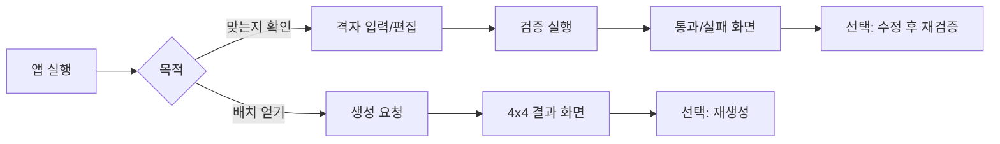

# 이해관계자·범위·제약

사용자 확인 사항(2026-05-28)을 반영한 범위 정의이다.

## 확정 제약

| 항목 | 결정 |
|------|------|
| 핵심 기능 | **생성** + **검증** (둘 다 동등하게 중요) |
| 결과 전달 | **화면 표시만** (파일 저장, REST API, 인쇄 등 불필요) |
| 관점 | **실제 서비스** 수준으로 요구·품질을 생각함 |
| 격자 크기 | 4×4 고정 (현재 범위) |
| 숫자 집합 | 1~16, 각 숫자 1회 (표준 4×4 마방진 전제) |

## 이해관계자 (서비스 관점)

| 역할 | 관심사 |
|------|--------|
| **최종 사용자** | 유효한 배치를 빠르게 얻거나, 직접/임의 배치가 맞는지 즉시 확인 |
| **제품·운영** | 기능이 예측 가능하고, 잘못된 입력·실패 시 메시지가 명확한지 |
| **개발·유지보수** | 생성·검증 규칙이 한 정의에 맞고, 변경·테스트가 쉬운지 |
| **품질** | “맞다/틀리다” 판별이 일관되고, 생성 결과는 항상 검증를 통과하는지 |

*단일 개발자 프로젝트여도, 위 역할을 가정하면 요구 누락을 줄일 수 있다.*

## 기능 범위 (In / Out)

### In scope (포함)

1. **검증**
   - 4×4 격자(16값)가 마방진 조건을 만족하는지 판별
   - 불완전 입력·중복·범위 밖 값 등에 대한 **명확한 거부/안내** (서비스 기준)

2. **생성**
   - 조건을 만족하는 4×4 배치를 **제공**
   - 생성 결과는 내부적으로 검증 규칙과 **동일한 정의**를 따름

3. **표시**
   - 결과 격자·검증 결과(성공/실패, 필요 시 합·오류 위치)를 **화면**에 표시

### Out of scope (현 단계에서 제외)

- 파일·클라우드·외부 API로의 결과보내기
- n×n 일반화, 사용자 정의 숫자 범위
- 계정·결제·다국어·접근성 인증 등 엔터프라이즈 기능
- 구현 기술 스택·UI 프레임워크 선택 (아직 문제 정의 단계)

## 사용자 여정 (관찰 수준)

## 비기능 요구 (서비스 관점에서의 관찰)

| 영역 | 서비스에서 기대하는 수준 (초기) |
|------|--------------------------------|
| **정확성** | 검증 결과와 생성물이 수학적 정의와 항상 일치 |
| **응답성** | 4×4 규모에서 생성·검증이 체감 즉시 (로컬 단일 사용자) |
| **명확성** | 실패 시 “무엇이 왜 틀렸는지” 화면에 표현 가능 |
| **신뢰** | 생성 파이프라인이 검증 규칙을 우회하지 않음 |
| **유지보수** | “유효한 마방진” 정의가 검증·생성·문서에서 동일 |

## 도메인 사실 (검증·생성 설계 시 참고, 구현 아님)

- 4×4 마방 상수: **34**
- 사용 숫자: **1~16**, 합 = 136 = 4 × 34
- 표준 정의: 4행, 4열, 주대각선, 부대각선 합이 모두 34

*회전·대칭으로 동일 해가 여러 개일 수 있음 → “몇 개까지 보여줄지”는 [04-open-questions.md](./04-open-questions.md) 참고.*
