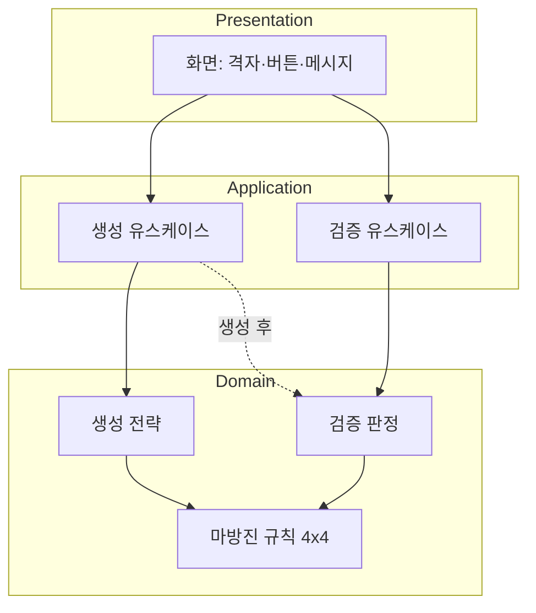

# 실제 서비스 기준 관점

개인 학습용 스크립트가 아니라, **배포 가능한 작은 제품**을 가정한 문제 정의이다.  
아직 아키텍처·코드는 없다.

## 1. 제품 한 줄 정의

> 사용자가 **4×4 마방진을 즉시 얻거나**, 자신이 만든 배치가 **규칙에 맞는지 화면에서 확인**할 수 있는 단일 화면(또는 소수 화면) 도구.

## 2. 핵심 가치 제안

| 가치 | 생성 | 검증 |
|------|------|------|
| 사용자 이득 | “맞는 배치”를 직접 계산하지 않아도 됨 | “내가 맞게 했는지” 즉시 확신 |
| 서비스 신뢰 | 제공된 배치는 항상 규칙 통과 | 판별 기준이 투명하고 일관됨 |
| 리스크 완화 | 잘못된 알고리즘 → 릴리스 전 자동 검증 테스트로 차단 | 모호한 오류 → 지원 문의·이탈 증가 |

**생성과 검증이 둘 다 중요**하다는 것은, 제품에서 **두 개의 동등한 1급 기능**이며 하나가 다른의 부속이 아니라는 뜻으로 해석한다.

- 생성만 있으면: 사용자가 결과를 믿을 근거(검증 UI·합 표시)가 약해질 수 있음
- 검증만 있으면: 진입 장벽이 높아 “빈 격자에서 시작” 사용자를 잃을 수 있음

## 3. 서비스 경계 (Bounded Context)

관찰:

- **Domain**: “4×4 + 1~16 + 행/열/대각 합 34” — 변경 시 버전·릴리스 노트 대상
- **Application**: 생성 요청, 검증 요청, 입력 정규화·오류 매핑
- **Presentation**: 격자 렌더링, 성공/실패, 로딩·빈 상태 (화면만)

생성 유스케이스는 서비스 품질상 **내부적으로 동일한 검증 규칙을 통과한 결과만** 화면에보내는 것이 바람직하다(구현 전제, 아키텍처 결정은 아님).

## 4. 기능을 서비스 수준으로 쪼갠 목록

### 4.1 검증 (Verification)

| ID | 기능 | 서비스 기대 |
|----|------|-------------|
| V-01 | 완전한 4×4 격자 검증 | 16칸 모두 유효할 때만 통과/실패 판정 |
| V-02 | 입력 무결성 | 중복, 범위 밖, 빈 칸, 비숫자 → 실패 + 이유 |
| V-03 | 결과 표시 | 통과 시 선택적으로 행/열/대각 합 34 표시 |
| V-04 | 실패 표시 | 실패 시 어떤 축이 34가 아닌지 식별 가능하면 UX 우수 |

### 4.2 생성 (Generation)

| ID | 기능 | 서비스 기대 |
|----|------|-------------|
| G-01 | 유효 배치 제공 | 한 번의 요청으로 규칙 만족 격자 |
| G-02 | 재생성 | 다른 배치 요청 (동일 해 반복 방지 여부는 정책) |
| G-03 | 생성 후 표시 | 화면에 4×4 표; 사용자가 “검증” 버튼으로 재확인 가능하면 신뢰 ↑ |
| G-04 | 결정성 정책 | 매번 동일 vs 랜덤 — 제품 정책으로 명시 필요 |

### 4.3 화면 (Display only — 확정)

| ID | 기능 | 서비스 기대 |
|----|------|-------------|
| D-01 | 격자 시각화 | 4×4 읽기 쉬운 레이아웃 |
| D-02 | 상태 메시지 | 로딩·성공·오류·빈 입력 |
| D-03 | 단순 내비게이션 | 생성 / 검증 모드 전환이 직관적 |

**명시적 비포함**: PDF, 이미지 저장, 공유 URL, 서버 동기화.

## 5. 품질·운영 (작은 서비스라도 적용)

| 관점 | 관찰 |
|------|------|
| **SLA (로컬)** | 생성·검증 1초 이내 체감 (4×4 한정) |
| **오류 처리** | 기술 스택 예외를 사용자에게 그대로 노출하지 않음 |
| **테스트 가능성** | 검증 = 순수 함수; 생성 = 샘플 + 자동 검증 게이트 |
| **릴리스** | 도메인 규칙 변경 시 회귀 테스트 필수 |
| **관측성** | 초기에는 로그 최소; 이후 사용 패턴(생성 vs 검증 비율) 확장 여지 |

## 6. 리스크·가정

| 가정 | 리스크 if 틀림 |
|------|----------------|
| 사용자는 1~16 표준 마방진만 다룸 | 커스텀 숫자 요구 시 범위 재정의 |
| 단일 사용자·로컬 실행 | 동시성·세션 불필요 |
| 화면만으로 충분 | 나중에 “공유” 요구 시 Out → In 전환 |
| 4×4 고정 | n 확장 시 UI·알고리즘 전면 변경 |

## 7. 성공 지표 (문제 정의 단계)

구현 전에 제품이 “됐다”고 말할 수 있는 기준:

1. 임의의 **생성** 결과를 검증 모듈(또는 동일 규칙)에 넣으면 **항상 통과**
2. 의도적으로 틀린 격자는 **항상 실패**, 이유가 화면에서 이해됨
3. 신규 사용자가 **설명 없이** 생성 또는 검증 중 하나를 1분 안에 완료

---

*다음 단계(문제 정의 STEP 3~): 유스케이스 상세, 오류 카탈로그, 화면 와이어 수준 — [04-open-questions.md](./04-open-questions.md)의 결정 후 진행 권장.*
