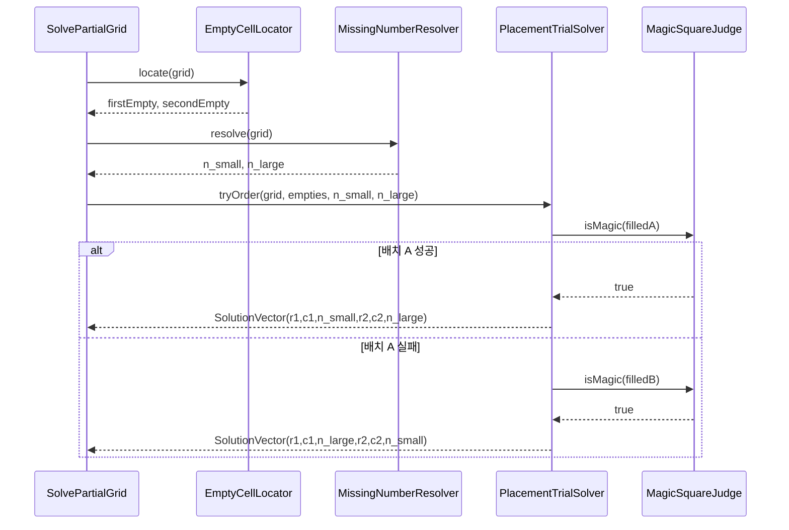
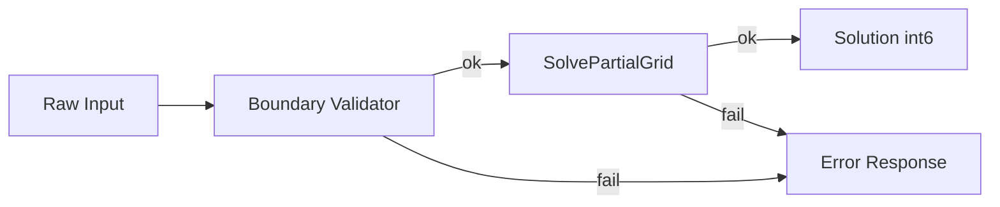
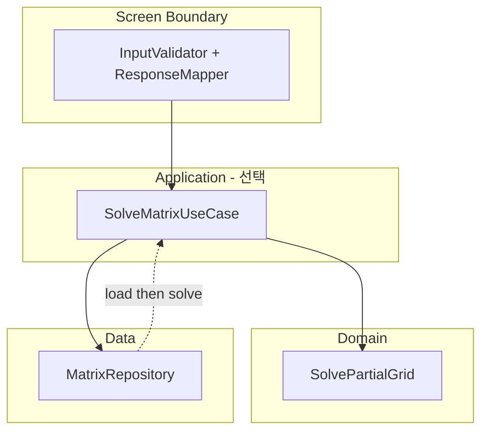

# Magic Square (4×4) — Dual-Track UI + Logic TDD / Clean Architecture 설계

| 항목 | 값 |
|------|-----|
| 목적 | 레이어 분리 · 계약 기반 테스트 · 리팩토링 훈련 (알고리즘 난이도 2순위) |
| 범위 | **부분 채움 격자(빈칸 2개) → 누락 숫자 2개 및 좌표 반환** |
| 구현 | 본 문서는 설계·계약·테스트·통합 계획만 (구현 코드 없음) |
| Magic Constant | **34** (4×4, 1~16 표준) |

---

# 1) Logic Layer (Domain Layer) 설계

## 1.1 도메인 개념

| 종류 | 이름 | 책임 (SRP) |
|------|------|------------|
| **Value Object** | `Grid4x4` | 4×4 정수 격자 보유; 크기·인덱스 접근 규칙 캡슐화 |
| **Value Object** | `Cell` | 단일 칸 값(0 또는 1~16); 0은 “빈칸” 의미만 표현 |
| **Value Object** | `Coordinate` | 1-index `(row, col)`; 빈칸 위치·반환 좌표에 사용 |
| **Value Object** | `MagicConstant` | 4×4 표준 마방 상수 **34** 단일 출처 |
| **Value Object** | `SolutionVector` | 길이 6: `[r1,c1,n1,r2,c2,n2]` 불변 표현 |
| **Entity** | *(없음)* | 상태 식별자·수명이 필요한 객체 없음 (순수 계산 도메인) |
| **Domain Service** | `EmptyCellLocator` | 격자에서 `0`인 칸을 **정확히 2개** 찾아 **결정적 순서**로 반환 |
| **Domain Service** | `MissingNumberResolver` | 1~16 중 격자에 없는 정수 2개를 오름차순 `(small, large)`로 반환 |
| **Domain Service** | `MagicSquareJudge` | **완전 채움** 격자가 마방진인지 판정 (행/열/주대각/부대각 합 = 34, 중복 없음) |
| **Domain Service** | `PlacementTrialSolver` | 두 빈칸에 `(small→첫빈칸, large→둘째빈칸)` / 반대 배치를 시도해 `SolutionVector` 선택 |
| **Domain Service** | `SolvePartialGrid` | 위 서비스를 조합한 **단일 유스케이스 진입점** (UI·Application이 호출) |

**레이어 규칙:** Domain은 UI·파일·콘솔 문자열에 의존하지 않음. 실패는 도메인 예외 타입 또는 `Result` 실패 값으로만 표현.

## 1.2 도메인 불변조건 (Invariants)

| ID | Invariant | 검증 가능 조건 |
|----|-----------|------------------|
| INV-G1 | 격자 크기는 항상 4×4 | `rows == 4 && cols == 4` |
| INV-G2 | 입력 칸 값은 `0` 또는 `1..16` | 각 셀 ∈ `{0} ∪ [1,16]` |
| INV-G3 | 입력에서 `0`은 **정확히 2개** | `count(0) == 2` |
| INV-G4 | `0` 제외 값은 **중복 없음** | `distinct(nonZero) == size(nonZero)` |
| INV-M1 | 완전 격자에서 1~16이 **각 1회** | `count(1..16) == 1` each |
| INV-M2 | 4행 합 = 4열 합 = 주대각 합 = 부대각 합 = **34** | 10개 선(line) 각각 `sum == 34` |
| INV-M3 | Magic Constant 단일 정의 | `MagicConstant.value == 34` |
| INV-O1 | 빈칸 순서는 **행 우선(row-major), 1-index** | `(r,c)` 비교: `r` 오름차순, 동일 행이면 `c` 오름차순 |
| INV-O2 | 누락 숫자 `(n_small, n_large)`는 `n_small < n_large` | 집합 `{1..16} \ present` |
| INV-O3 | 출력 `(n1,n2)`는 **마방진이 되는 배치 순서** | 첫 시도(작은수→첫빈칸) 통과 시 `[..., n_small, ..., n_large]`; 실패 시 반대 |
| INV-O4 | 반환 좌표는 **1-index** | `1 <= r,c <= 4` |
| INV-S1 | 유효 입력이면 **항상 길이 6 배열** 반환 | `length == 6` |
| INV-S2 | 반환의 `n1,n2`는 누락 숫자 집합과 일치 | `{n1,n2} == {n_small, n_large}` |

## 1.3 핵심 유스케이스 (도메인 관점)



| 단계 | 유스케이스 | 설명 |
|------|------------|------|
| UC-1 | 빈칸 찾기 | `0` 셀 2개 → `Coordinate` 쌍 (INV-O1 순서) |
| UC-2 | 누락 숫자 찾기 | present = non-zero values; missing = {1..16} \ present |
| UC-3 | 마방진 판정 | 완전 격자에 INV-M1, INV-M2 적용 |
| UC-4 | 두 조합 시도 | (small→empty1, large→empty2) 후 판정; 실패 시 좌표는 유지·숫자만 스왑 |
| UC-5 | 해 반환 | `int[6]` = `[r1,c1,n1,r2,c2,n2]` |

**도메인 전제:** 유효 입력(계약 만족)에 대해 **최소 하나**의 배치는 마방진이 된다고 가정하지 않음 — 둘 다 실패 시 도메인 실패 `UnsolvableGrid` (통합·UI에서 매핑).

## 1.4 Domain API (내부 계약)

> 표기: `int[4][4]` = 4행×4열. 실패는 `Failure` 또는 도메인 예외. **구현 코드 없음.**

| API | 입력 | 출력 | 성공 조건 | 실패 조건 |
|-----|------|------|-----------|-----------|
| `EmptyCellLocator.locate` | `grid` | `(Coordinate first, Coordinate second)` | INV-G1~G4, INV-G3 | `count(0) != 2` → `InvalidEmptyCount` |
| `MissingNumberResolver.resolve` | `grid` | `(int nSmall, int nLarge)` | non-zero가 14개, 1~16 부분집합 | non-zero 14개 아님 → `InvalidPresentCount`; 범위/중복 위반 → 각각 `InvalidCellValue`, `DuplicateValue` |
| `MagicSquareJudge.isMagic` | `grid` (0 없음) | `boolean` | — | 크기≠4×4 → `InvalidGridSize`; 0 존재 → `GridNotComplete` |
| `PlacementTrialSolver.solve` | `grid`, `first`, `second`, `nSmall`, `nLarge` | `SolutionVector` | 두 시도 중 하나 `isMagic==true` | 둘 다 false → `UnsolvableGrid` |
| `SolvePartialGrid.execute` | `grid` (UI 검증 통과 가정 가능) | `int[6]` | 전체 파이프라인 성공 | 위 실패 전파 |

**`SolutionVector` 필드 규약**

| 인덱스 | 필드 | 제약 |
|--------|------|------|
| 0,1 | r1,c1 | 첫 빈칸 좌표 (1-index) |
| 2 | n1 | 첫 빈칸에 넣는 값 |
| 3,4 | r2,c2 | 둘째 빈칸 좌표 |
| 5 | n2 | 둘째 빈칸에 넣는 값 |

## 1.5 Domain 단위 테스트 설계 (RED 우선)

### 테스트 실행 순서 (TDD 사이클)

| Cycle | RED 목표 | GREEN 최소 구현 | REFACTOR 트리거 |
|-------|----------|-----------------|-----------------|
| D-01 | `MagicSquareJudge` — 알려진 완전 마방진 1개 | 행 합만 검사 → 확장 | 10선 검사 중복 제거 |
| D-02 | `MagicSquareJudge` — 합 틀린 격자 | 단일 false 경로 | — |
| D-03 | `EmptyCellLocator` — 빈칸 2개 위치 | row-major 순서 고정 | 좌표 VO 추출 |
| D-04 | `MissingNumberResolver` — 누락 2개 | 집합 차집합 | — |
| D-05 | `PlacementTrialSolver` — 순서 규칙 | 첫 배치 시도 후 분기 | Judge 주입 |
| D-06 | `SolvePartialGrid` E2E (도메인만) | 파사드 조립 | — |

### 테스트 케이스 표

| ID | 유형 | Given | When | Then | 보호 Invariant |
|----|------|-------|------|------|----------------|
| DJ-01 | 정상 | 알려진 표준 4×4 완전 마방진 | `isMagic` | `true` | INV-M1, M2 |
| DJ-02 | 정상 | DJ-01에서 한 칸만 1 증가(중복 유발) | `isMagic` | `false` | INV-M1 |
| DJ-03 | 정상 | DJ-01에서 한 행 두 칸 swap(합 유지 가능) | `isMagic` | `false` (일반적으로) | INV-M2 |
| DJ-04 | 엣지 | 한 행 합만 34, 나머지 깨짐 | `isMagic` | `false` | INV-M2 |
| DJ-05 | 비정상 | 격자에 `0` 포함 | `isMagic` | `GridNotComplete` | 완전성 전제 |
| DE-01 | 정상 | 빈칸 (2,3), (4,1) 배치된 4×4 | `locate` | `[(2,3),(4,1)]` | INV-O1 |
| DE-02 | 비정상 | 빈칸 1개 | `locate` | `InvalidEmptyCount` | INV-G3 |
| DE-03 | 비정상 | 빈칸 3개 | `locate` | `InvalidEmptyCount` | INV-G3 |
| DM-01 | 정상 | 1~14가 채워진 격자, 누락 {15,16} | `resolve` | `(15,16)` | INV-O2 |
| DM-02 | 비정상 | non-zero 13개 | `resolve` | `InvalidPresentCount` | 14개 전제 |
| DP-01 | 정상 | 첫 배치 (small→e1, large→e2)가 마방진 | `solve` | `n1==small` | INV-O3 |
| DP-02 | 정상 | 첫 배치 실패, 둘째 성공 | `solve` | `n1==large` | INV-O3 |
| DP-03 | 비정상 | 두 배치 모두 실패 | `solve` | `UnsolvableGrid` | — |
| DS-01 | 정상 | 공개 샘플 퍼즐 1 (문서 부록) | `execute` | `int[6]` 길이 6, 좌표 1-index | INV-S1,S2,O4 |
| DS-02 | 정상 | 공개 샘플 퍼즐 2 (순서 반대 케이스) | `execute` | `n1 > n2` 허용 (반대 배치) | INV-O3 |
| DS-03 | 비정상 | 내부적으로 unsolvable | `execute` | `UnsolvableGrid` | — |

**픽스처:** 완전 마방진 1개, 부분 격자 2개(첫 시도 성공/실패)를 `fixtures/known-grids.json`에 고정 (Data 레이어와 공유 가능).

---

# 2) Screen Layer (UI Layer) 설계 (Boundary Layer)

> UI = **입력/출력 경계**. 실제 위젯·CSS 없음. **Adapter**가 외부 문자열/배열 ↔ 도메인 `grid` 변환.

## 2.1 사용자/호출자 관점 시나리오

| # | 시나리오 | 흐름 |
|---|----------|------|
| S-1 | 정상 풀이 | 행렬 입력 → 구조 검증 → 도메인 `execute` → `[r1,c1,n1,r2,c2,n2]` 출력 |
| S-2 | 입력 오류 | 행렬 입력 → 구조 검증 실패 → **에러 코드 + 고정 문구** (도메인 미호출) |
| S-3 | 도메인 실패 | 검증 통과 → `execute` → `UnsolvableGrid` → **도메인 실패 코드 + 고정 문구** |
| S-4 | (선택) 저장 후 재실행 | 검증 통과 → Data `save` → 이후 `load` → S-1과 동일 |



## 2.2 UI 계약 (외부 계약)

### Input schema

| 필드 | 타입 | 제약 |
|------|------|------|
| `matrix` | `int[4][4]` | 필수 |
| `matrix[r][c]` | `int` | `0` 또는 `1..16` |
| 빈칸 | — | `count(0) == 2` |
| 중복 | — | non-zero 값 집합 크기 = non-zero 개수 |

### Output schema (성공)

| 필드 | 타입 | 제약 |
|------|------|------|
| `result` | `int[6]` | `[r1,c1,n1,r2,c2,n2]` |
| `r1,c1,r2,c2` | `int` | 각각 1..4 |
| `n1,n2` | `int` | 각각 1..16, `n1 != n2` |

### Error schema

| 필드 | 타입 | 제약 |
|------|------|------|
| `code` | `string` | 아래 카탈로그 값과 **완전 일치** |
| `message` | `string` | 아래 카탈로그 `message`와 **바이트 단위 동일** (로케일 고정: ko-KR) |
| `details` | `object?` | 선택; 키는 카탈로그에 정의된 경우만 |

## 2.3 UI 레벨 테스트 (Contract-first, RED 우선)

**전제:** Domain `SolvePartialGrid`는 **Mock**. Mock은 고정 `int[6]` 또는 예외만 반환.

| ID | Given (입력) | Mock | Then | 검증 포인트 |
|----|--------------|------|------|----------------|
| UI-01 | 유효 4×4, 빈칸 2 | 성공 벡터 반환 | HTTP/함수 성공 + `result` Mock과 동일 | 출력 스키마 |
| UI-02 | 3×4 행렬 | 호출 없음 | `GRID_SIZE_INVALID` | 크기 |
| UI-03 | 4×4, 빈칸 1 | 호출 없음 | `EMPTY_CELL_COUNT_INVALID` | INV-G3 |
| UI-04 | 4×4, 빈칸 3 | 호출 없음 | `EMPTY_CELL_COUNT_INVALID` | INV-G3 |
| UI-05 | 셀 값 17 | 호출 없음 | `CELL_VALUE_OUT_OF_RANGE` | INV-G2 |
| UI-06 | 셀 값 -1 | 호출 없음 | `CELL_VALUE_OUT_OF_RANGE` | INV-G2 |
| UI-07 | non-zero 중복 2개 | 호출 없음 | `DUPLICATE_NON_ZERO` | INV-G4 |
| UI-08 | non-zero 13개(빈칸 3) | — | `EMPTY_CELL_COUNT_INVALID` (빈칸 검사 우선순위 명시) | 검사 순서 고정 |
| UI-09 | 유효 입력 | Mock `UnsolvableGrid` | `DOMAIN_UNSOLVABLE` | 도메인 실패 매핑 |
| UI-10 | 유효 입력 | Mock 성공 `[2,3,5,4,1,11]` | 각 필드 1-index, 길이 6 | INV-O4, S1 |

**검사 순서 (고정 — 테스트로 잠금):**

1. `GRID_SIZE_INVALID`
2. `CELL_VALUE_OUT_OF_RANGE`
3. `DUPLICATE_NON_ZERO`
4. `EMPTY_CELL_COUNT_INVALID`
5. Domain 호출
6. 출력 포맷 검증 (`1 <= r,c <= 4`, `length==6`)

## 2.4 UX/출력 규칙

### 성공 출력 (텍스트 경계, 선택)

```
OK [r1,c1,n1,r2,c2,n2]
```

- 접두사 `OK ` (대문자, 공백 1개)
- 6개 정수, 쉼표 구분, **공백 없음**
- 예: `OK [2,3,5,4,1,11]`

### 에러 메시지 카탈로그 (문구 고정)

| code | message (정확히 이 문자열) | details 키 |
|------|------------------------------|------------|
| `GRID_SIZE_INVALID` | `입력은 4x4 행렬이어야 합니다.` | `rows`, `cols` |
| `CELL_VALUE_OUT_OF_RANGE` | `칸 값은 0 또는 1~16이어야 합니다.` | `row`, `col`, `value` |
| `DUPLICATE_NON_ZERO` | `0을 제외한 값은 중복될 수 없습니다.` | `value` |
| `EMPTY_CELL_COUNT_INVALID` | `빈칸(0)은 정확히 2개여야 합니다.` | `count` |
| `DOMAIN_UNSOLVABLE` | `주어진 격자로 마방진을 완성할 수 없습니다.` | — |
| `OUTPUT_FORMAT_INTERNAL` | `결과 형식이 올바르지 않습니다.` | — (Domain 성공 후 UI 검증 실패 시) |

**금지:** 스택 트레이스, 예외 클래스명, 영문 기술 메시지를 최종 사용자 경계에 노출.

---

# 3) Data Layer 설계

## 3.1 목적 정의

| 항목 | 내용 |
|------|------|
| 필요성 | 동일 퍼즐 재입력 없이 **마지막 입력·결과 재현**; TDD에서 Repository 패턴·교체 가능성 학습 |
| In scope | 입력 `int[4][4]`, (선택) 마지막 `int[6]` 결과, ISO-8601 타임스탬프 |
| Out of scope | DB, 네트워크, 다중 사용자, 버전 마이그레이션 |

## 3.2 인터페이스 계약

| 메서드 | 입력 | 출력 | 실패 |
|--------|------|------|------|
| `MatrixRepository.save(sessionId, grid, result?)` | `sessionId: string`, `grid: int[4][4]`, `result: int[6]?` | `void` | `StorageWriteError` |
| `MatrixRepository.load(sessionId)` | `sessionId` | `Snapshot { grid, result?, savedAt }` | `SnapshotNotFound` |
| `MatrixRepository.delete(sessionId)` | `sessionId` | `void` | (없어도 idempotent 성공) |

**`Snapshot` 불변조건:** `load` 후 `grid`는 INV-G1, G2 만족 (저장 시점에 UI 검증 통과한 것만 저장).

## 3.3 구현 옵션 비교

| 옵션 | 장점 | 단점 |
|------|------|------|
| **A: InMemory** | 테스트 빠름, 의존성 0 | 프로세스 종료 시 소실 |
| **B: File (JSON)** | 재시작 후 유지, 스냅샷 눈으로 확인 | 경로·권한·형식 오류 처리 필요 |

**추천: A를 기본 구현, B를 2차 어댑터**

- 이유: Domain/UI 테스트는 A로 격리; 통합 테스트 1개만 B로 파일 I/O 검증하면 **80% Data 커버리지** 달성 가능.

**JSON 스키마 (파일):**

```json
{
  "version": 1,
  "grid": [[...4],[...4],[...4],[...4]],
  "result": [r1,c1,n1,r2,c2,n2],
  "savedAt": "2026-05-28T12:00:00+09:00"
}
```

## 3.4 Data 레이어 테스트

| ID | 시나리오 | Then |
|----|----------|------|
| DR-01 | save → load 동일 session | `grid` deep equals, `result` equals |
| DR-02 | load 없는 session | `SnapshotNotFound` |
| DR-03 | JSON 깨진 파일 | `StorageCorruptError` |
| DR-04 | grid 행 수 3 | `StorageCorruptError` (로드 시 4×4 검증) |
| DR-05 | delete 후 load | `SnapshotNotFound` |

---

# 4) Integration & Verification

## 4.1 통합 경로 정의



**의존성 방향:** `UI → Application → Domain`; `Application → Data`. **Domain → Data 금지.**

| 경로 | 설명 |
|------|------|
| P1 | `UI → Domain` (Application 생략 시) — 최소 통합 |
| P2 | `UI → Application → Domain` — UseCase + Repository 오케스트레이션 |
| P3 | `UI → Application → Data(load) → Domain` — 저장된 격자 재풀이 |

## 4.2 통합 테스트 시나리오

| ID | 유형 | 경로 | Given | Then |
|----|------|------|-------|------|
| IT-01 | 정상 | P1 | 샘플 퍼즐 A | `OK` + 예상 `int[6]` |
| IT-02 | 정상 | P1 | 샘플 퍼즐 B (반대 순서) | `n1 > n2` 가능 |
| IT-03 | 정상 | P3 | save 후 load+execute | IT-01과 동일 결과 |
| IT-04 | 실패 | P1 | 3×4 | `GRID_SIZE_INVALID`, Domain 미호출 |
| IT-05 | 실패 | P1 | 중복 non-zero | `DUPLICATE_NON_ZERO` |
| IT-06 | 실패 | P1 | unsolvable fixture | `DOMAIN_UNSOLVABLE` |
| IT-07 | 실패 | P3 | 삭제된 snapshot | `SnapshotNotFound` → UI 매핑 `STORAGE_NOT_FOUND` *(Application에서 추가 코드 1개)* |

## 4.3 회귀 보호 규칙

| 규칙 ID | 내용 |
|---------|------|
| RG-01 | `report`·본 문서에 고정된 **입력/출력 계약** 변경 시 **MAJOR** 버전 + 전 테스트 스냅샷 갱신 |
| RG-02 | 에러 `message` 문자열 변경 금지 (변경 시 UI 계약 테스트 일괄 업데이트만 허용) |
| RG-03 | 빈칸 순서(row-major) 변경 금지 — 변경 시 `DE-01`, `IT-02` 필수 갱신 |
| RG-04 | Domain 테스트 Mock 없이 **실제 Judge** 사용 (통합 제외) |
| RG-05 | CI에서 Domain → UI → Data → Integration 순서 실행; 실패 시 배포 차단 |

## 4.4 커버리지 목표

| 레이어 | 목표 | 측정 범위 |
|--------|------|-----------|
| Domain Logic | **≥ 95%** branch | `EmptyCellLocator`, `MissingNumberResolver`, `MagicSquareJudge`, `PlacementTrialSolver`, `SolvePartialGrid` |
| UI Boundary | **≥ 85%** branch | Validator, ErrorMapper, ResponseFormatter (Domain Mock) |
| Data | **≥ 80%** branch | `InMemory` + `File` 어댑터 각각 |
| Integration | 시나리오 **7개 전부 통과** | 커버리지 도구 미사용 시 이 기준으로 대체 |

## 4.5 Traceability Matrix (필수)

| Concept (Invariant) | Rule | Use Case | Contract | Test | Component |
|---------------------|------|----------|----------|------|-----------|
| INV-G1 | 4×4만 허용 | S-2 | Input `matrix` | UI-02 | BoundaryValidator |
| INV-G2 | 0 또는 1~16 | S-2 | Input cell | UI-05,06 | BoundaryValidator |
| INV-G3 | 빈칸 2개 | S-2 | Input empty count | UI-03,04 | BoundaryValidator |
| INV-G4 | non-zero 유일 | S-2 | Input uniqueness | UI-07 | BoundaryValidator |
| INV-M2 | 10선 합 34 | UC-3 | `isMagic` | DJ-01~04 | MagicSquareJudge |
| INV-O1 | row-major 빈칸 | UC-1 | `locate` order | DE-01 | EmptyCellLocator |
| INV-O2 | missing 정렬 | UC-2 | `resolve` | DM-01 | MissingNumberResolver |
| INV-O3 | 배치 순서 | UC-4 | Output n1,n2 | DP-01,02, DS-02 | PlacementTrialSolver |
| INV-O4 | 1-index 좌표 | UC-5 | Output r,c | UI-10, DS-01 | BoundaryValidator + Solver |
| INV-S1 | 길이 6 | UC-5 | `int[6]` | UI-01, DS-01 | SolvePartialGrid |
| 저장 무결성 | 4×4 유지 | S-4 | Snapshot.grid | DR-04 | FileMatrixRepository |
| 에러 문구 고정 | 카탈로그 | S-2,S-3 | Error.message | UI-02~07 | ErrorMapper |

---

## 부록 A — 샘플 퍼즐 (통합 테스트용, 수동 검증)

> 완전 해 기준 격자 (참고용, 1-index):

```
16  3  2 13
 5 10 11  8
 9  6  7 12
 4 15 14  1
```

### 퍼즐 A — 첫 배치 성공 (`n1 < n2`)

| | c1 | c2 | c3 | c4 |
|---|-----|-----|-----|-----|
| r1 | **0** | 3 | 2 | 13 |
| r2 | 5 | 10 | 11 | 8 |
| r3 | 9 | 6 | 7 | 12 |
| r4 | 4 | 15 | 14 | **0** |

| 항목 | 값 |
|------|-----|
| 빈칸 (row-major) | (1,1), (4,4) |
| 누락 숫자 | 1, 16 → `n_small=1`, `n_large=16` |
| 첫 시도 (1→(1,1), 16→(4,4)) | 완전 격자 = 기준 마방진 → **성공** |
| **기대 `int[6]`** | `[1, 1, 1, 4, 4, 16]` |

### 퍼즐 B — 반대 배치 성공 (`n1 > n2`)

| | c1 | c2 | c3 | c4 |
|---|-----|-----|-----|-----|
| r1 | **0** | 3 | 2 | 13 |
| r2 | 5 | **0** | 11 | 8 |
| r3 | 9 | 6 | 7 | 12 |
| r4 | 4 | 15 | 14 | 1 |

| 항목 | 값 |
|------|-----|
| 빈칸 (row-major) | (1,1), (2,2) |
| 누락 숫자 | 10, 16 → `n_small=10`, `n_large=16` |
| 첫 시도 (10→(1,1), 16→(2,2)) | 완전 격자 ≠ 마방진 → **실패** |
| 둘째 시도 (16→(1,1), 10→(2,2)) | 기준 마방진과 동일 → **성공** |
| **기대 `int[6]`** | `[1, 1, 16, 2, 2, 10]` (`n1=16 > n2=10`) |

### 퍼즐 C — 해 없음 (`UnsolvableGrid`, IT-06)

| | c1 | c2 | c3 | c4 |
|---|-----|-----|-----|-----|
| r1 | **0** | 3 | 2 | **0** |
| r2 | 5 | 10 | 11 | 8 |
| r3 | 9 | 6 | 7 | 12 |
| r4 | 4 | 15 | 14 | 1 |

| 항목 | 값 |
|------|-----|
| 빈칸 | (1,1), (1,4) |
| 누락 | 4, 16 |
| 두 배치 모두 | 행1 합 ≠ 34 → `DOMAIN_UNSOLVABLE` |

## 부록 B — Dual-Track TDD 병행 일정 (1주)

| 일 | Logic Track (Domain) | UI Track (Boundary) |
|----|----------------------|---------------------|
| 1 | DJ-01~02 RED/GREEN | UI-02~06 RED (Mock Domain) |
| 2 | DE-01~03, DM-01 | UI-03~07 GREEN |
| 3 | DP-01~03 | UI-01,09,10 |
| 4 | DS-01~03 | IT-01~06 |
| 5 | Refactor + 커버리지 95% | DR-01~05 + IT-03,07 |

## 부록 C — 즉시 실행 체크리스트 (다음 액션 5)

- [ ] `fixtures/known-grids.json`에 완전 마방진 1개 + 부분 퍼즐 A/B 확정
- [ ] Domain `DJ-01` RED 테스트 파일 생성 (구현 없이 실패 확인)
- [ ] UI `UI-02` RED + Error 카탈로그 enum/constants 고정
- [ ] `MatrixRepository` 인터페이스 시그니처만 패키지에 추가 (InMemory 스텁 반환 null)
- [ ] Traceability Matrix 행 수 = 테스트 ID 수 일치 검토 (본 문서: Domain 16 + UI 10 + Data 5 + Integration 7)

---

*문서 버전: 1.0 | 2026-05-28 | 입력/출력 계약 사용자 고정안 반영*
